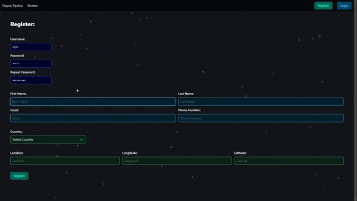
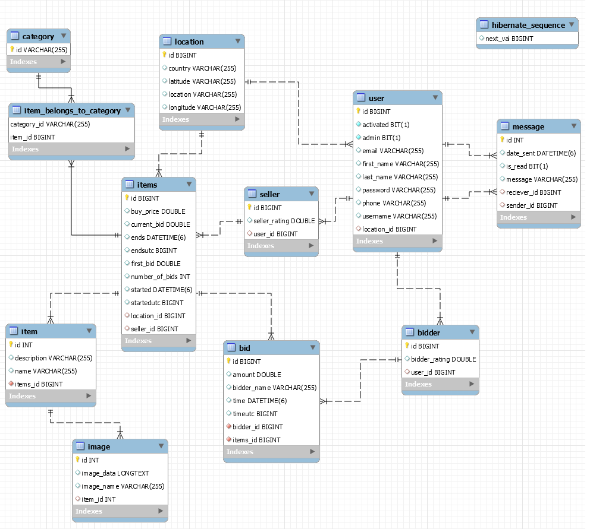

# Auctions App Front End

# Εργασία για Τεχνολογίες Εφαρμογών Διαδικτύου

## ΚΕΦΑΛΑΙΑ

1. [Εισαγωγή](#1-Εισαγωγή)
2. [Εκτέλεση](#2-Εκτέλεση)
3. [Back-End](#3-Back-End)
   - [3.1 Μερικές σημαντικές διευκρινήσεις](#31-Μερικές-σημαντικές-διευκρινήσεις)
   - [3.2 Μοντέλο](#32-Μοντέλο)
   - [3.3 Προστασία / Security](#33-Προστασία--Security)
   - [3.4 Controllers](#34-Controllers)
   - [3.5 Services / Repositories](#35-Services--Repositories)
4. [Front-End](#4-Front-End)
   - [4.1 Μερικές γενικές διευκρινήσεις](#41-Μερικές-γενικές-διευκρινήσεις)
   - [4.2 Χρήστες](#42-Χρήστες)
   - [4.3 Εγγραφή και Σύνδεση](#43-Εγγραφή-και-Σύνδεση)
   - [4.4 Αναζήτηση δημοπρασιών](#44-Αναζήτηση-δημοπρασιών)
   - [4.5 Δημιουργία και επεξεργασία δημοπρασιών](#45-Δημιουργία-και-επεξεργασία-δημοπρασιών)
   - [4.6 Η σελίδα της δημοπρασίας](#46-Η-σελίδα-της-δημοπρασίας)
   - [4.7 Μηνύματα](#47-Μηνύματα)

---

## 1. Εισαγωγή

Στόχος της εργασίας είναι η ανάπτυξη εφαρμογής/ιστοσελίδας δημοπρασιών.

Οι εγγεγραμένοι χρήστες μπορούν να δημιουργήσουν δικές τους δημοπρασίες που περιέχουν αντικείμενα προς πώληση, συνοδευόμενα από εικόνες.

Άλλοι χρήστες έχουν τη δυνατότητα να υποβάλουν προσφορές για να διεκδικήσουν τα αντικείμενα. Η αναζήτηση δημοπρασιών υποστηρίζει φίλτρα, και αναζήτηση ελεύθερου κειμένου.

Ο νικητής μίας δημοπρασίας μπορεί να στείλει και να παραλάβει μηνύματα από τον προσφοροδότη, ώστε να έρθουν σε επικοινωνία μετά το τέλος της δημοπρασίας.

Τα υπόλοιπα κεφάλαια περιγράφουν πως λειτουργεί η εργασία, εξηγούν πως μπορεί να εκτελεστεί, και αναλύουν όλες τις σημαντικές σχεδιαστικές επιλογές ή παραδοχές της υλοποίησης.

---

## 2. Εκτέλεση

To BackEnd έχει γίνει με Spring Boot, και το FrontEnd με Angular CLI. Και τα δύο φτιάχτηκαν μέσω του IntelliJ Idea.

- Δημιουργία βάσης δεδομένων
- Τροποποίηση αρχείου `application.properties` με τα κατάλληλα στοιχεία (για σύνδεση με την βάση)
- Τρέχουμε το BackEnd
- Πηγαίνουμε στο https://localhost:8443/
- Επιτρέπουμε μέσω του browser πρόσβαση στην σελίδα (λόγω self-signed certificate)
- Τρέχουμε το FrontEnd
- Πηγαίνουμε στο http://localhost:4200/

---

## 3. Back-End

### 3.1 Μερικές σημαντικές διευκρινήσεις

Κάθε φορά που τρέχει το Back End στο αρχείο `LoadDatabase.java`, αρχικοποιούνται κάποια δεδομένα στην βάση. Αυτά είναι τα παρακάτω:

- Προσθήκη διαχειριστή στους χρήστες, αν δεν υπάρχει κανένας ήδη στην βάση.
- Προσθήκη τοποθεσιών, δύο χρηστών, και δύο μηνυμάτων στη βάση (Προστίθενται κάθε φορά που τρέχει το BackEnd, ακόμα και αν υπάρχουν ήδη στην βάση).
- Προσθήκη κατηγοριών στη βάση, αν δεν υπάρχουν ήδη.
- Προσθήκη δύο δημοπρασιών στη βάση, μαζί με τα αντίστοιχα αντικείμενα τους. (Προστίθενται κάθε φορά που τρέχει το BackEnd, ακόμα και αν υπάρχουν ήδη στην βάση).

Αξίζει να σημειωθεί πως τα μηνύματα προστίθενται άμεσα στην βάση. Στην πραγματικότητα οι χρήστες που βλέπουν τα μηνύματα αυτά δεν έχουν όντως την δυνατότητα να επικοινωνήσουν. Αυτό επιτρέπεται μόλις ο ένας χρήστης βγει νικητής στη δημοπρασία του άλλου.

### 3.2 Μοντέλο

Εικόνα της βάσης στο MySQL:

Έχουν δημιουργηθεί κλάσεις/πίνακες `Bidder` και `Seller`, που συνδέονται με τον `User` με 1-1 σχέση. Το πεδίο `admin` του `User` δείχνει αν είναι διαχειριστής ή όχι.

Η κλάση `Items` αντιστοιχεί σε μία δημοπρασία, ενώ η `Item` σε ένα αντικείμενο μίας δημοπρασίας.

Οι κλάσεις `MessageElement` και `BidElement` είναι βοηθητικές για παραλαβή ορισμένων αντικειμένων από σώμα ενός request.

### 3.3 Προστασία / Security

Το αρχείο `springboot.p12` είναι το self-signed certificate που χρησιμοποιείται για το SSL.

Η βάση του spring security είναι κοινή με αυτή των διαλέξεων (4 αρχεία στο security package), με τις παρακάτω προσθήκες:

- Στο `JWTAuthenticationFilter.java`, σε επιτυχές authentication προστίθενται δύο επιπλέον headers, ένα για το username, και ένα για το admin status του χρήστη.
- Στο `JWTAuthorizationFilter.java`, η `getAuthentication` επιστρέφει token το οποίο περιέχει και authorities με τους ρόλους του χρήστη. Οι ρόλοι είναι `user`, `admin`.
- Στο `WebSecurity.java` και στο `ProjectBackEndApplication.java` βρίσκονται γενικές ρυθμίσεις για το web security. Στο 1o `configure` του `WebSecurity.java` δηλώνονται και ποιά μονοπάτια μπορούν να προσπελαστούν χωρίς authentication/authorization.

Οι ρόλοι που βρίσκονται εντός του authorization token χρησιμοποιούνται στα controllers για να επιτρέπουν ή όχι την πρόσβαση σε ορισμένα request σε ορισμένα URLs (με `@PreAuthorize`).

Περισσότερες λεπτομέρειες για το ποιά request επιτρέπονται πότε, βρίσκονται στο παρακάτω κεφάλαιο (controllers).

### 3.4 Controllers

Υπάρχουν 3 controllers. Ένα για users, ένα για δημοπρασίες (`items`), και ένα για messages.

**UserController.java**:

- Όλα τα request στο `/users` απαιτούν ρόλο διαχειριστή.
- Στο `/getUserFromUsername/{username}`, μπορεί να στείλει request μόνο ο χρήστης με το δοσμένο username. Το response body περιέχει όλα τα στοιχεία του χρήστη (δηλαδή μόνο ο συνδεδεμένος χρήστης μπορεί να δει τα στοιχεία του).
- Το `/userExists` χρησιμοποιείται κατά την εγγραφή για να ελεγχθεί αν ένα όνομα χρήστη υπάρχει ήδη.

**ItemsController.java**:

- Όλοι μπορούν να κάνουν get requests όσον αφορά τις δημοπρασίες, ακόμα και επισκέπτες.
- Τα `/itemsOfSeller` και `/sellerOfItems` επιστρέφουν τις δημοπρασίες ενός seller και τον seller μίας δημοπρασίας αντίστοιχα. Είναι βοηθητικά για το Front End.
- Μόνο οι εγγεγραμένοι χρήστες και διαχειριστές μπορούν να υποβάλουν προσφορές και να δημιουργήσουν δημοπρασίες.
- Μόνο ο δημιουργός μίας δημοπρασίας μπορεί να την διαγράψει ή να την επεξεργαστεί, και μόνο αν δεν έχουν υποβληθεί προσφορές.

**MessageController.java**:

- Μόνο ο συνδεδεμένος χρήστης μπορεί να επεξεργαστεί, δει, ή δημιουργήσει οποιοδήποτε μήνυμα του.

### 3.5 Services / Repositories

Στα services UserService και ItemsService, η προσθήκη, διαγραφή, και η επεξεργασία οντοτήτων
είναι λίγο πιο περίπλοκη, επειδή παράλληλα διαχειρίζονται και άλλες σχετικές οντότητες
(πχ, όταν διαγράφεται ένας χρήστης, διαγράφονται και οι δημοπρασίες του, όταν προστίθενται
ένας χρήστης προστίθενται ταυτόχρονα ένας seller και bidder κοκ.)

Η loadUserByUsername επιστρέφει ειδικό αντικείμενο UserDetails, το οποίο μέσα περιέχει τους ρόλους
του χρήστη (δες κεφάλαιο 3.3). Για τον ίδιο τον user, χρησιμοποιείται η getUserFromUsername.

Η updateUser απλά ενεργοποιεί (account activation) τον χρήστη.

Η getRelevantUsers του MessageService επιστρέφει όλους τους χρήστες με τους οποίους μπορεί να
επικοινωνήσει ένας χρήστης (δηλαδή αυτούς που έχουν κερδίσει δημοπρασία του και το αντίστροφο).

Οι getOngoingAuctions, getOngoingAuctionOfSeller του ItemsService επιστρέφουν μόνο τις ενεργές
δημοπρασίες (δεν έχουν λήξει και δεν έχει υπάρξει νικητής ακόμα).

---

## 4. Front-End

### 4.1 Μερικές γενικές διευκρινήσεις

Υπάρχει μόνο ένα module.

Για styling χρησιμοποιείται απλή css. Το περισσότερo css βρίσκεται στο styles.css.

Υπάρχουν δύο guards: το AuthGuard και το LoginGuard.
Στο app.module.ts, υπάρχουν ορισμένα routes τα οποία τα χρησιμοποιούν για να αποτρέψουν πρόσβαση.

 - Το AuthGuard χρησιμοποιείται στα routes των χρηστών. Έχουν πρόσβαση μόνο οι διαχειριστές.

 - To LoginGuard χρησιμοποιείται για τα μηνύματα και κάποιες σελίδες σχετικές με δημοπρασίες.
   Έχουν πρόσβαση μόνο όσοι είναι συνδεδεμένοι.

Ο φάκελος model περιέχει κλάσεις typescript αντίστοιχες με τις κλάσεις μοντέλου της java στο back
end (user, location, items κλπ).

### 4.2 Χρήστες

Στο μονοπάτι /users, χρησιμοποιούνται τα components user, και user-details.
Χρησιμοποιείται το user.service.ts για επικοινωνία με το back end.
Μόνο συνδεδεμένοι διαχειριστές έχουν πρόσβαση σε αυτό το μονοπάτι.

Τo user component λαμβάνει την λίστα με τους χρήστες και την εμφανίζει. Το κάθε στοιχείο της λίστας
είναι σύνδεσμος που οδηγεί στο user details component του συγκεκριμένου χρήστη.

Το user details component λαμβάνει τον χρήστη και εμφανίζει λεπτομέρειες για αυτόν.
Εδώ ο διαχειριστής μπορεί επίσης να ενεργοποιήσει και να διαγράψει χρήστες (χρήση user service).

### 4.3 Εγγραφή και Σύνδεση

Το logout κουμπί του app component χρησιμοποιεί το authentication service για να σβήσει τα
αποθηκευμένα στοιχεία του συνδεδεμένου χρήστη από το local storage.

login component:

 - Περιέχει μία φόρμα που ζητάει username και password.

 - Αν η φόρμα είναι έγκυρη, χρησιμοποιείται το authentication service για να γίνει login.

 - Αποθηκεύουμε κάποια headers από το response στο local storage (JWT token, admin status, username).
   (τα δύο τελευταία headers υπάρχουν μόνο για άνεση).

 - Χρησιμοποιείται το user service για ανάκτηση του user αντικειμένου του χρήστη που μόλις συνδέθηκε.

register component:

 - !!! Περιέχει μία φόρμα με όλα τα απαραίτητα στοιχεία για εγγραφή. Οι τοποθεσίες είναι
   προκαθορισμένες και επιλέγονται από μία λίστα.

 - Εφόσον η φόρμα είναι έγκυρη, έλεγχουμε αν το username υπάρχει ήδη μέσω του user service.
   Αν δεν υπάρχει, τότε προσθέτουμε τον χρήστη στη βάση, εμφανίζουμε κατάλληλο μήνυμα,
   και ανακατευθύνουμε στην σελίδα του login.

### 4.4 Αναζήτηση δημοπρασιών

Τα μονοπάτια /items και /myItems χρησιμοποιούν το ίδιο component, το items component.

Και στις δύο περιπτώσεις εμφανίζεται μία λίστα από δημοπρασίες, η οποία μπορεί να φιλτραριστεί.

 - Στο /items έχουν πρόσβαση όλοι, και δείχνει όλες τις ενεργές δημοπρασίες.

 - Στο /myItems έχουν πρόσβαση μόνο οι συνδεδεμένοι χρήστες, και εμφανίζονται μόνο οι δικές τους
   δημοπρασίες. Επιπλέον, εδώ εμφανίζεται και η επιλογή δημιουργίας δημοπρασίας, η οποία 
   ανακατευθύνει στην αντίστοιχη σελίδα.

Το items component αρχικά κοιτάζει σε ποιό μονοπάτι βρισκόμαστε, και ανάλογα καλεί την κατάλληλη
συνάρτηση του items service, για να λάβει είτε όλες τις δημοπρασίες (/items), ή μόνο τις
δημοπρασίες του συνδεδεμένου χρήστη (/myItems).

Η λίστα των δημοπρασιών ενημερώνεται ανάλογα με τα επιλεγμένα φίλτρα όταν πατηθεί το κουμπί
"search". Από την αρχική λίστα αφαιρούμε δημοπρασίες που δεν ικανοποιούν τα φίλτρα, και 
προβάλουμε μόνο τις επιθυμητές.

### 4.5 Δημιουργία και επεξεργασία δημοπρασιών

Στο μονοπάτι myItems/add υπάρχει το add items component.

Παρουσιάζεται μία φόρμα με όλα τα απαραίτητα στοιχεία για την δημιουργία της δημοπρασίας.

 - Στην κορυφή εμφανίζονται τα τρέχοντα αντικείμενα (που έχουν προστεθεί) της δημοπρασίας.
   Αυτά μπορούν να αφαιρεθούν.

 - Για να προστεθεί ένα νέο αντικείμενο στην δημοπρασία συμπληρώνουμε το όνομα και την περιγραφή
   του αντικειμένου. Αν θέλουμε να προσθέσουμε εικόνες στο αντικείμενο, τότε:
    - επιλέγουμε φωτογραφία, και πατάμε το κουμπί "Upload". Επαναλαμβάνουμε για κάθε φωτογραφία
       του αντικειμένου.
    - συμπληρώνουμε όνομα και περιγραφή όπως κανονικά, και πατάμε "Add Item"
    
 - Οι κατηγορίες δημοπρασίων είναι προκαθορισμένες. Επιλέγουμε τις επιθυμητές.

 - Για την τοποθεσία της δημοπρασίας, πρέπει να συμπληρωθούν χώρα και τοποθεσία.
   !!! Προαιρετικά, μπορούν να προστεθούν και γεωγραφικές συντεταγμένες. Σε αυτήν την περίπτωση,
   η σελίδα της δημοπρασίας θα συμπεριλαμβάνει και έναν χάρτη που θα δείχνει την τοποθεσία.
   Σε κάθε περίπτωση, θα δημιουργηθεί καινούργια τοποθεσία στη βάση.

Στο μονοπάτι /items/{itemsId}/edit (προσβάσιμο στην σελίδα της δημοπρασίας) υπάρχει το edit
items component, το οποίο είναι πολύ παρόμοιο με το add items component.

Οι διαφορές είναι ότι στα πεδία φαίνεται η προηγούμενη (τρέχουσα) τιμή, η οποία προαιρετικά πλέον
μπορεί να ενημερωθεί. Τα αντικείμενα της δημοπρασίας μπορούν επίσης να διαγραφούν, ή να προστεθούν
καινούργια (ΠΡΟΣΟΧΗ: Οι κατηγορίες πρέπει να επιλεχθούν ξανά από την αρχή).

Από την σελίδα δημοπρασίας μπορεί επίσης να διαφραφεί μία δημοπρασία.

Επεξεργασία και διαγραφή δημοπρασιών από τον δημιουργό επιτρέπεται μόνο αν είναι ενεργές και
δεν τους έχουν υποβληθεί ακόμα προσφορές.

### 4.6 Η σελίδα της δημοπρασίας

Χρησιμοποιείται το item details component.

Εμφανίζονται στοιχεία της δημοπρασίας, τα αντικείμενα της δημοπρασίας μαζί με τις εικόνες τους,
ένας χάρτης που δείχνει την τοποθεσία της δημοπρασίας (αν είχαν δωθεί γεωγραφικές συντεταγμένες
κατά την δημιουργία), και το ιστορικό των προσφορών.

Αν η δημοπρασία δεν ανήκει στον συνδεδεμένο χρήστη, τότε εμφανίζεται και επιλογή υποβολής
προσφοράς. Οι επισκέπτες δεν έχουν την επιλογή αυτή.

Αν η δημοπρασία ανήκει στον συνδεδεμένο χρήστη, τότε εμφανίζονται επιλογές επεξεργασίας/διαγραφής
της δημοπρασίας (αν αυτές είναι εφικτές), καθώς και επιλογή λήψης της δημοπρασίας σε αρχείο
μορφής XML.

Για να διαπιστωθεί αν η δημοπρασία ανήκει στον συνδεδεμένο χρήστη χρησιμοποιείται η συνάρτηση
isThisMine(), η οποία καλεί την getSellerFromItems του items service.

### 4.7 Μηνύματα

Η δυνατότητα αποστολής μηνυμάτων ενεργοποιείται μόνο μεταξύ του νικητή και του προσφοροδότη. Κανένας άλλος χρήστης δεν μπορεί να στείλει μήνυμα.

Σημείωση: Μόνο οι συνδεδεμένοι χρήστες μπορούν να δουν τα μηνύματα τους, ενώ οι υπόλοιποι μπορούν να δουν μόνο τα στοιχεία των δημοπρασιών.

# About Angular

This project was generated with [Angular CLI](https://github.com/angular/angular-cli) version 13.3.5.

## Development server

Run `ng serve` for a dev server. Navigate to `http://localhost:4200/`. The application will automatically reload if you change any of the source files.

## Code scaffolding

Run `ng generate component component-name` to generate a new component. You can also use `ng generate directive|pipe|service|class|guard|interface|enum|module`.

## Build

Run `ng build` to build the project. The build artifacts will be stored in the `dist/` directory.

## Running unit tests

Run `ng test` to execute the unit tests via [Karma](https://karma-runner.github.io).

## Running end-to-end tests

Run `ng e2e` to execute the end-to-end tests via a platform of your choice. To use this command, you need to first add a package that implements end-to-end testing capabilities.

## Further help

To get more help on the Angular CLI use `ng help` or go check out the [Angular CLI Overview and Command Reference](https://angular.io/cli) page.
